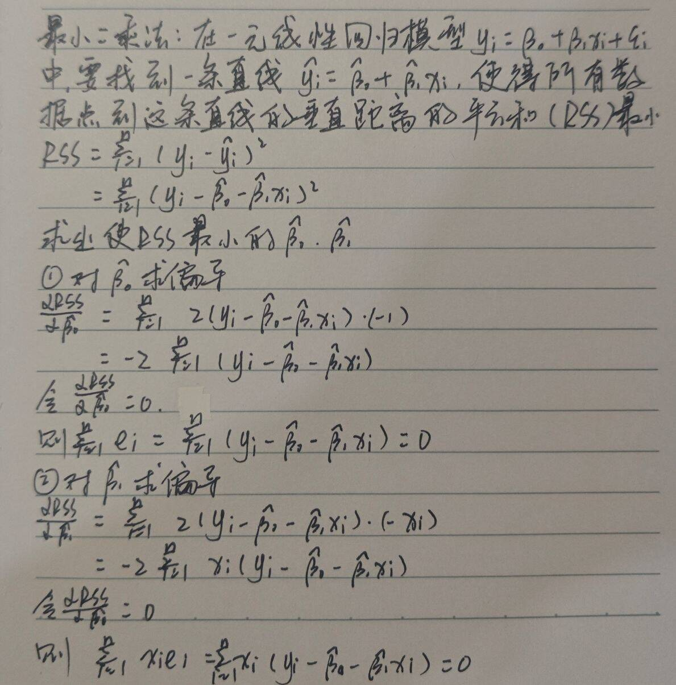

Q1：请在纸上推导证明一元线性回归中，残差之和必然等于零（$`\sum_{i=1}^{n}e_i=0`$），残差与自变量乘积之和也必然等于零($`\sum_{i=1}^{n}x_ie_i=0`$)。

Q2：为什么在多元回归中，往模型中添加一个纯随机生成的无关特征，$`R^2`$会上升或保持不变，而$`R_{adj}^2`$会下降？请用自由度与$`RSS`$变动解释。

$`R^2=1-\frac{RSS}{TSS}`$，其中$`RSS`$是残差平方和（模型没解释掉的误差），$`TSS`$是总离差平方和（数据的总波动，是个定值）
当往模型中添加一个纯随机生成的无关特征时，即使这个无关特征只能解释极其微小的随机波动，$`RSS`$也会减小，如果这个无关特征在当前模型中没有产生任何线性影响，回归系数的估计值在理论上被算作零，此时$`RSS`$不变\
所以$`RSS`$减小或不变时，$`R^2`$会上升或保持不变

$`R_{adj}^2=1-\frac{RSS/(n-p-1)}{TSS/(n-1)}`$，其中$`n`$是样本量（固定不变），$`p`$是自变量个数（每加一个变量，$`p`$加1）
当往模型中添加一个纯随机的无关特征时，$`RSS`$会减小或不变，但由于这个变量是纯随机的无关特征，所以减小非常微小，而因为多了一个变量，$`(n-p-1)`$减小，$`\frac{RSS}{n-p-1}`$变大\
所以自由度$`df=n-p-1`$的损失远大于$`RSS`$的减少，$`R_{adj}^2`$下降
